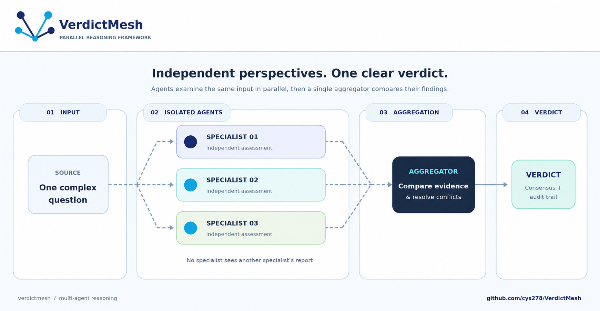

# VerdictMesh

**VerdictMesh** is a lightweight Python framework for **parallel, and isolated multi-agent reasoning and consensus**. It is purpose-built for complex, decomposable tasks that require independent, multi-perspective analysis without logical contamination.

Unlike traditional sequential agent chains where models bias each other through shared chat histories, VerdictMesh executes domain specialists in **Parallel Isolated Threads**. Every angle of a high-stakes decision, from clinical diagnostics to financial risk and legal audits, is evaluated in pristine isolation before being synthesized by a centralized verification layer.




## Why VerdictMesh?

Standard multi-agent frameworks suffer from **Cognitive Tunnel Vision** and **Groupthink**, where early outputs dictate downstream reasoning. VerdictMesh eliminates this through a robust, thread-safe architecture:

* **Parallel Isolation:** Expert agents operate in private threads with zero awareness of peer outputs, guaranteeing objective, unpolluted analysis.
* **Centralized Consensus:** A specialized aggregator audits isolated reports, resolving logical conflicts and highlighting evidence gaps before delivering a type-safe verdict.
* **Audit-First Design:** Every execution generates an immutable, 100% traceable log of expert rationale and error states, meeting **EU AI Act** requirements for monitorable enterprise AI.
* **Portable Expertise:** Agents can be equipped with **Skills**, markdown-based knowledge packs parsed with zero external dependencies, letting you inject domain procedure without writing a single line of prompt-engineering code.

## How VerdictMesh Compares

| Feature | VerdictMesh | Sequential Frameworks (e.g., CrewAI, AutoGen) | Routing Graph Frameworks (e.g., LangGraph) |
| :--- | :--- | :--- | :--- |
| **Execution Model** | **Parallel Isolated Threads** | Sequential / Turn-Based Chat | Directed Acyclic Graphs (DAGs) |
| **Cognitive Bias Protection** | **100% (Zero Peer Awareness)** | Low (Agents read previous chat logs) | Moderate (Depends on node state) |
| **Fault Tolerance** | **Thread-Level Isolation & Recovery** | Global workflow fails on node crash | Complex custom retry logic required |
| **Dependencies** | **Just one (Pydantic). Everything else, including Skills, is pure stdlib.** | Heavy (LangChain, Pydantic, etc.) | Heavy |
| **Primary Use Case** | **High-Stakes Consensus & Auditing** | Conversational Task Automation | Complex Stateful Workflows |

## Scientifically Validated Performance

VerdictMesh is built on the architectural principles validated in the study **["Towards a Science of Scaling Agent Systems"](https://research.google/blog/towards-a-science-of-scaling-agent-systems-when-and-why-agent-systems-work/)** (Google Research / MIT). Research confirms that for analytical, decomposable tasks, a **Parallel Isolated** architecture delivers a massive performance delta over standard sequential models:

| Benchmark | Task Domain | Performance Gain vs. Single-Agent |
| :--- | :--- | :--- |
| **Finance-Agent (FAB)** | **Decomposable Financial Reasoning** | **+80.8% 🚀** |
| **Workbench** | **Structured Business Planning** | **+57.2%** |
| **PlanCraft** | **Sequential Automation** | *(Use Single-Agent Instead)* |

## Architecture & Anatomy

https://github.com/user-attachments/assets/663369cc-98ce-4950-8614-a88219020a4c

For the full technical breakdown, engine internals, aggregator implementations, and the research this design is grounded in, see the [Technical White Paper](docs/white-paper.md).

---

## Quickstart

VerdictMesh is designed to be developer-first, model-agnostic, and lightweight.

### 1. Install
```batch
python -m pip install -e .
```


### 2. Bring Your Own LLM
VerdictMesh is a "Pure Engine." It does not force you to install heavy SDKs or learn proprietary API wrappers. You maintain 100% control over your models and API keys.
```python
import openai

client = openai.Client(api_key="sk-...")

def my_llm(prompt: str) -> str:
    response = client.chat.completions.create(
        model="gpt-4o",
        messages=[{"role": "user", "content": prompt}],
        temperature=0.3
    )
    return response.choices[0].message.content
```


### 3. 60-Second Demo
Three domain specialists analyze a case in parallel, fully isolated from each other, then a Synthesizer merges their reports into one executive verdict.

```python
from verdictmesh.agents.presets import cfo_agent, cro_agent, data_sovereignty_auditor
from verdictmesh.aggregators import Synthesizer
from verdictmesh.engine import Engine

engine = Engine(
    agents=[
        cfo_agent(my_llm),
        cro_agent(my_llm),
        data_sovereignty_auditor(my_llm),
    ],
    aggregator=Synthesizer(llm_callable=my_llm)
)

report = engine.run(
    problem_data="Startup acquisition dossier: SaaS platform, $2M ARR, EU-based customer data..."
)

print(report.consensus.narrative)
```

That's a full parallel-isolated reasoning pipeline , no custom classes, no prompt engineering. See the [Official Preset Agents](#official-preset-agents) catalog for all 13 available specialists. Everything below shows how to build your own agents, aggregators, and Skills from scratch.

### 4. Define Specialist Agents from Scratch
Agents inherit from `Agent` and implement an `execute()` method. The framework builds the strict "Forced Perspective" identity prompt for you, while you retain full control over the execution loop.
```python
from verdictmesh.base import Agent

class TechAnalyst(Agent):
    def __init__(self, llm_callable):
        super().__init__(
            role="Chief Technology Officer", 
            goal="Evaluate technical feasibility and database scalability.",
            llm_callable=llm_callable
        )

    def execute(self, problem_data: str) -> str:
        # 1. Framework generates a strict, isolated identity prompt
        system_prompt = self._build_prompt(problem_data)

        # 2. You control the API execution (or tool injection!) 
        full_prompt = f"{system_prompt} Please provide your expert analysis."
        
        return self.llm_callable(full_prompt)
```

💡 **Using Tools?** You own the `execute()` loop! You can bypass the simple text wrapper and inject your provider's native tool schemas (e.g., OpenAI functions or external database hooks) directly into the API call.

### 5. Define an Aggregator
The Aggregator waits for all experts to finish, reads their parallel reports, and synthesizes the final executive decision.

```python
from verdictmesh.base import Aggregator
from typing import Any

class ChiefConsensusOfficer(Aggregator):
    def __init__(self, llm_callable):
        super().__init__(
            role="Chief Aggregator",
            goal="Synthesize expert opinions into a final verdict",
            llm_callable=llm_callable
        )

    def execute(self, agent_reports: dict[str, str]) -> Any:
        # Helper method cleanly formats valid reports and injects anti-hallucination guardrails
        compiled_reports = self._format_reports(agent_reports)
        
        prompt = f"""
        Role: {self.role}
        Goal: {self.goal}
        Reports:{compiled_reports}
        FINAL VERDICT:
        """
        return self.llm_callable(prompt)
```

### 6. Run the Parallel Engine
The engine launches all agents concurrently, traps individual thread failures without crashing the pool, and pipes clean data to the aggregator.

```python
from verdictmesh.engine import Engine

# 1. Initialize your workforce
tech_expert = TechAnalyst(llm_callable=my_llm)
# finance_expert = FinanceSpecialist(llm_callable=my_llm)
# legal_expert = LegalExpert(llm_callable=my_llm)

engine = Engine(
    agents=[tech_expert], 
    aggregator=ChiefConsensusOfficer(llm_callable=my_llm)
)

# 2. Broadcast the problem data to all agents simultaneously
report = engine.run(
    problem_data="Full Project Alpha Investment Case File...",
    show_log=True  # Enables real-time execution tracing in your terminal
)

print(f"Consensus:\n{report.consensus}") 
print(f"Audit Trail:\n{report.traces}")
```

### Expected Terminal Output

```batch

[ENGINE] Booting VerdictMesh Parallel Reasoning Workflow...
[ENGINE] Provisioned Agents: 1 | Assigned Aggregator: Chief Aggregator
  ├── [Dispatching] Thread launched for Chief Technology Officer...
  └── [Success] Collected structured report from Chief Technology Officer.
[ENGINE] >>> PHASE 2: Aggregated Consensus

Consensus:
Technical feasibility is APPROVED. The architecture supports isolated scaling without bottlenecking database read operations.

Audit Trail:
[Trace(agent_role='Chief Technology Officer', status='success', error_message=None)]
```

## Official Preset Agents

Beyond custom `Agent` subclasses, VerdictMesh ships pre-built specialists , each a `SkilledAgent` bundled with a curated, versioned Skill. Import them directly from `verdictmesh.agents.presets`.

### Startup Due-Diligence Council
For evaluating a business, product, or investment case from every executive angle in parallel.

| Preset | Role | Focus |
| :--- | :--- | :--- |
| `cfo_agent` | Chief Financial Officer | Runway, burn rate, margin threats |
| `cto_agent` | Chief Technology Officer | Scalability bottlenecks, tech debt, key-person risk |
| `cro_agent` | Chief Revenue Officer | Market synergy, sales cycle friction, integration timelines |
| `cpo_agent` | Chief Product Officer | Product-Market Fit, defensibility, churn risk |
| `cmo_agent` | Chief Marketing Officer | CAC:LTV ratios, acquisition channel sustainability |

### Regulatory & Compliance Auditors
For flagging legal and regulatory exposure before it reaches a human reviewer.

| Preset | Role | Focus |
| :--- | :--- | :--- |
| `data_sovereignty_auditor` | Data Sovereignty Auditor | GDPR Art. 5/17 , cross-border transfers, retention limits |
| `ai_risk_assessor` | AI Risk Assessor | EU AI Act regulatory tiering |
| `phi_sanitizer` | Health Data Compliance Officer | Special Category Data (PHI) handling & anonymization |
| `licensing_reviewer` | Open-Source Compliance Engineer | Copyleft (GPL/AGPL) contamination risk |

### Security
For analyzing security logs and access events from complementary, non-overlapping angles, each preset stays scoped to its own layer so findings don't overlap or contradict.

| Preset | Role | Focus |
| :--- | :--- | :--- |
| `security_threat_hunter` | Security Threat Hunter | External intrusions, indicators of compromise, MITRE ATT&CK mapping |
| `insider_threat_analyst` | Insider Threat Analyst | Anomalous behavior from authenticated users, post-login |
| `identity_access_auditor` | Identity & Access Auditor | Failed-login clustering, privilege-escalation chains, MFA-bypass indicators, how access was obtained |
| `breach_notification_analyst` | Breach Notification Analyst | GDPR Art. 33/34 breach-notification triage and timelines |

```python
from verdictmesh.agents.presets import cfo_agent, cto_agent, licensing_reviewer
from verdictmesh.aggregators import Synthesizer
from verdictmesh.engine import Engine

engine = Engine(
    agents=[cfo_agent(my_llm), cto_agent(my_llm), licensing_reviewer(my_llm)],
    aggregator=Synthesizer(llm_callable=my_llm)
)
report = engine.run(problem_data="Startup acquisition dossier...")
```

Every preset accepts `extra_skills=[...]` to layer your own domain knowledge on top of the official one , no subclassing required:

```python
from verdictmesh.skills import Skill
from pathlib import Path

house_style = Skill.from_file(Path("skills/our_valuation_method/SKILL.md"))
finance_expert = cfo_agent(llm_callable=my_llm, extra_skills=[house_style])
```

## Writing Custom Skills

A Skill is a markdown file with a simple `key: value` frontmatter block , no YAML library, no nested lists or objects, just flat fields:

```markdown
---
name: churn-risk-heuristics
description: Detects early churn signals from usage and support ticket data.
version: 1.0.0
---

## Churn Risk Heuristics
1. Flag accounts with >30% MoM usage decline...
2. Cross-reference support ticket sentiment...
```

Load it into any agent:

```python
from pathlib import Path
from verdictmesh.skills import Skill
from verdictmesh.agents.skilled_agent import SkilledAgent

my_skill = Skill.from_file(Path("skills/churn-risk-heuristics/SKILL.md"))
agent = SkilledAgent(role="Growth Analyst", goal="...", llm_callable=my_llm, skills=[my_skill])
```

Skills attached to an agent are surfaced by name and description in every prompt by default (cheap, always-on). Full skill content is only loaded on demand , see `Agent.get_skill()` and `Agent.load_relevant_skills()` in `base.py` for manual vs. automatic selection.

## Official Enterprise Aggregators

While VerdictMesh allows you to build custom aggregators, we provide out-of-the-box modules designed for enterprise-grade verification and consensus.

### 1. ConflictChecker
The deterministic "Chief Justice" of your architecture. It audits expert reports for logical contradictions, timeline mismatches, and incompatible claims.

* **Strategy 1 (Prompt-Matrix):** Single-call audit using a structured internal comparative matrix.
* **Strategy 2 (Parallel Pairwise):** Multi-threaded execution that programmatically spawns isolated bilateral threads across all unique agent pairs for absolute, reproducible auditability.
* **Mathematical Safety Gate:** Automatically aborts audits without wasting API tokens if upstream failures reduce surviving reports to fewer than 2.

```python
from verdictmesh.aggregators import ConflictChecker

boss = ConflictChecker(
    llm_callable=my_llm,
    pairwise_audit=True,  # Toggle to True for multi-threaded O(N^2) pairwise isolation
    max_threads=5,
    show_log=True
)
```
### 2. Synthesizer
The "Chief Integration Officer." It merges multiple isolated expert reports into a single cohesive executive narrative, automatically resolving redundancies, mapping citations strictly to responding agents, and zeroing out confidence scores if upstream pipelines fail.
```python
from verdictmesh.aggregators import Synthesizer

writer = Synthesizer(
    llm_callable=my_llm,
    show_log=True
)
```
### 3. WeightedSynthesizer
A `Synthesizer` variant for **proportional emphasis**. When some perspectives should shape the final narrative more than others as a baseline , not just when they conflict , you assign weights per agent role, and the higher-weighted perspectives drive the framing and conclusions while lower-weighted ones are folded in as supporting context. This is distinct from `ConflictChecker`: it is about prominence in the blend, applied even when all experts fully agree.

* **Missing weights:** any responding role absent from `weights` falls back to equal footing (`default_weight=1.0`) , unweighted agents are never silently dropped.
* **Normalization:** weights are normalized to sum to 1.0; `weights_applied` and `dominant_perspective` are recorded on the result as a deterministic audit trail of how the blend was shaped.
* **Degenerate case:** equal weights produce output equivalent to the plain `Synthesizer`.

```python
from verdictmesh.aggregators import WeightedSynthesizer

boss = WeightedSynthesizer(
    llm_callable=my_llm,
    weights={
        "CTO": 0.7,
        "CRO": 0.2,
        "GDPR Auditor": 0.1,
    },
    show_log=True
)
```
Check out the `/cookbook/` directory for full examples of these aggregators in action.

## Repository Structure

* `/src/verdictmesh/engine.py`: High-performance parallel orchestrator with thread-level exception trapping.
* `/src/verdictmesh/base.py`: Superior abstract base classes with automated threshold gates and anti-hallucination prompt injection.
* `/src/verdictmesh/skills.py`: The `Skill` class, parses SKILL.md frontmatter + content with zero external dependencies.
* `/src/verdictmesh/agents/presets.py`: Official ready-to-use domain specialists (CFO, CTO, GDPR auditor, etc.).
* `/src/verdictmesh/agents/skilled_agent.py`: `SkilledAgent`, the concrete, ready-to-use Agent that powers all official presets.
* `/src/verdictmesh/agents/skills/`: Bundled SKILL.md knowledge packs powering the official presets.
* `/src/verdictmesh/aggregators/`: Standardized synthesis and deterministic auditing logic.

## Future Roadmap

We are actively expanding VerdictMesh from a library into a comprehensive ecosystem for high-stakes reasoning:

* **Expanded Preset Catalog:** Community-contributed Skills reviewed and merged into the official preset library.
* **Expanded Aggregator Suite:** Out-of-the-box integration for democratic Majority Vote streams, strict Minimax boundary-testing gates, and categorical Classifiers.
* **Octonodes:** A production-grade visual application interface allowing architects to drag-and-drop parallel topologies, map data hooks, and export automated Python/Rust deployment code.
* **HITL Gateways:** Native Human-in-the-Loop intercept protocols allowing domain experts to step in at critical decision forks or review aggregated conflict logs before execution.
## Project origin and license

VerdictMesh adapts the Octochains source originally published by Ahmad Varasteh. The original work and authorship remain identified in `LICENSE`; the original project is at https://github.com/ahmadvh/octochains. The package name and examples in this copy have been renamed.
